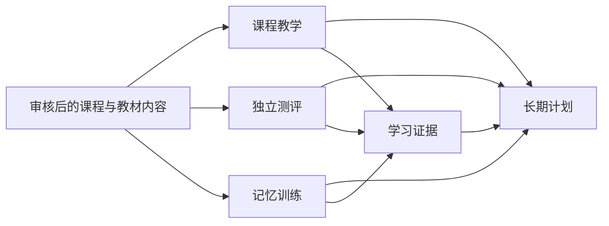

# Academy 架构说明

更新：2026 年 9 月 17 日。

## 产品边界

Academy 面向需要自主补学和长期备考的高中生，目标范围是浙江高考语文、数学、英语、物理、化学、技术六科。平台把课程教学、独立测评、记忆训练和长期计划接在一起，但各部分使用适合自己的数据模型。

账号采用邀请制。管理员负责邀请码、AI 接口和教材内容；当前不设家长、教师、学校或支付角色。

## 当前状态

| 部分     | 状态   | 目前能够确认的能力                                                 |
| :------- | :----- | :----------------------------------------------------------------- |
| 记忆训练 | 已实现 | 英语词汇、古诗词、间隔复习、错题巩固、延迟正确率与学习分析         |
| 六科目录 | 已建立 | 六科范围、课程状态、记忆模块归属和首个课程样例由共享目录统一定义   |
| 连续课程 | 接入中 | 动量定理的课程目标与流程已经确定，课堂运行、追问和学习证据尚未接入 |
| 独立测评 | 待开发 | 接口中预留独立任务类型，尚无正式运行与评分记录                     |
| 长期计划 | 待开发 | 接口可以区分课程、测评和记忆复习，尚未生成真实的跨科计划           |

网站只把第一项标为可学习。其余状态在公开页、课程页与项目材料中使用同一套表述。

## 模块划分

### 课程目录

课程目录是六科范围和建设状态的唯一来源。Web 端的课程页、首页进度和后续计划接口都读取 `packages/shared/src/curriculum.ts`，避免多个页面各写一份不同的学科清单。

目录只描述课程身份、目标、流程与状态，不假装保存学生的课堂进度。

### 课程教学

连续课程围绕可验证的课程目标组织，计划流程为：基础检查、概念与推导、课中追问、分层练习、独立测评、延迟复测。

课程运行需要独立记录课程位置、学生作答、使用过的提示和追问分支。它不复用词汇与古诗词的线性题目队列，也不把概念或解题步骤塞入 FSRS 卡片。当前共享目录和界面已经建立，这部分运行数据仍是 `[TODO]`。

### 记忆训练

英语词汇与古诗词保留为完整模块。它适合使用主动回忆、同组回练、FSRS 调度和延迟正确率。现有 `ContentKind` 继续只表示 `word` 与 `poem`，不会扩成数学、物理等学科。

这样的边界可以保留已完成的产品，也避免把“记住一个词”和“会独立完成一道动量题”混成同一种掌握度。

### 独立测评

独立测评使用未在讲解中直接展示的题目，并记录评分规则、提示使用和作答版本。测评结果形成学习证据，供后续补学与复测使用。正式题库与评分数据结构为 `[TODO]`。

### 长期计划

长期计划只负责组合三类任务：课程、独立测评、记忆复习。每类任务仍由原模块判断是否完成。共享类型 `PlanTask` 已经区分三种任务；生成优先级、跨科负荷和中断后的重排规则为 `[TODO]`。

## 课程运行的目标接口

| 概念              | 作用                                 | 当前状态         |
| :---------------- | :----------------------------------- | :--------------- |
| Course            | 经过审核的连续课程定义               | 目录中有首个样例 |
| Course goal       | 可独立验证的学习目标                 | 动量课程已有目标 |
| Lesson step       | 检查、讲解、例题、练习或测评步骤     | `[TODO]`         |
| Lesson run        | 学生可中断并恢复的一次课程进度       | `[TODO]`         |
| Question branch   | 依附课程位置的追问，结束后返回原步骤 | `[TODO]`         |
| Assistance record | 提示、讲解和查看答案的使用记录       | `[TODO]`         |
| Learning evidence | 作答、测评和延迟复测形成的不可变证据 | `[TODO]`         |

这些术语也写入根目录的 `CONTEXT.md`。实现时先接入一门动量课程，再根据真实使用结果决定数据库迁移，当前不建立没有运行行为的空表。

## 现有记忆训练数据流

1. 管理员生成邀请码；数据库只保存 SHA-256 哈希，明文只返回一次。
2. 学生注册后获得随机会话 token；浏览器仅持有 Secure、HttpOnly、SameSite=Strict Cookie，数据库只保存 token 哈希。
3. 教材条目使用稳定的 `content_items` 身份。每次导入、编辑、发布、归档和恢复形成不可变的 `content_versions`；草稿可与上一已发布版本并存。
4. 内容导入采用预检与确认两阶段流程。应用前若内容基线变化，整批原子拒绝；回滚通过追加恢复版本实现。
5. 记忆计划先安排当前年级的到期内容，再按每日容量补充新内容。学生可按教材单元、到期项目或历史错题建立学习会话。
6. 会话固定每道题的内容身份与版本。回答形成不可变 `review_events`；若内容版本已替换，旧结果保留，但不会更新当前 FSRS 状态。
7. 答错或查看答案的内容会在至少两个其他项目后回练一次。结束后生成首轮正确率、回练纠正数、反应时间、掌握度与本组错题。
8. 至少间隔 24 小时的复习进入延迟正确率；稳定期达到 21 天的项目计入长期记忆。
9. AI 请求只包含会话固定的教材版本、题目和本次回答，不发送用户名或个人档案。

## 运行结构

| 层   | 技术                                           | 责任                                                      |
| :--- | :--------------------------------------------- | :-------------------------------------------------------- |
| Web  | React 19、Vite、React Router、`@lailai0916/ui` | 课程目录、记忆训练、学习分析、社交、个人与管理界面        |
| API  | Fastify 5、Zod                                 | 认证、权限、内容、记忆训练、AI 与社交业务；课程运行待接入 |
| 数据 | PostgreSQL、Drizzle ORM                        | 用户、内容版本、复习事件、FSRS 卡片与社交关系             |
| 调度 | `ts-fsrs`                                      | 只为词汇和古诗词等记忆项目安排复习                        |
| AI   | OpenAI 兼容 Chat Completions                   | 基于已审核内容生成讲解和变式；课程追问待接入              |
| 边缘 | Caddy                                          | TLS、静态文件、SPA 回退与 `/api` 反向代理                 |

## 安全与隐私

- Argon2id 保存密码；登录、注册与修改密码有速率限制；修改密码会撤销其他登录会话；写请求校验 Origin；
- 管理权限在 API 强制执行，前端路由隐藏不构成权限边界；
- AI Key 以 AES-256-GCM 加密，密钥只存在生产环境变量；
- API 容器以非 root、只读文件系统和最小 Linux capability 运行；
- PostgreSQL 不暴露公网端口；API 只绑定宿主机 `127.0.0.1:4100`；
- Umami 不上报用户名、作答、教材内容、AI 响应或其他敏感学习数据。

## 下一段实现

首个实现切口是动量定理课程。它需要依次补齐课程定义、可恢复的课程运行、追问分支、帮助记录、独立测评和延迟复测，再让长期计划读取这些结果。词汇与古诗词继续使用现有记忆训练接口，不因课程接入而迁移或重置学习记录。
